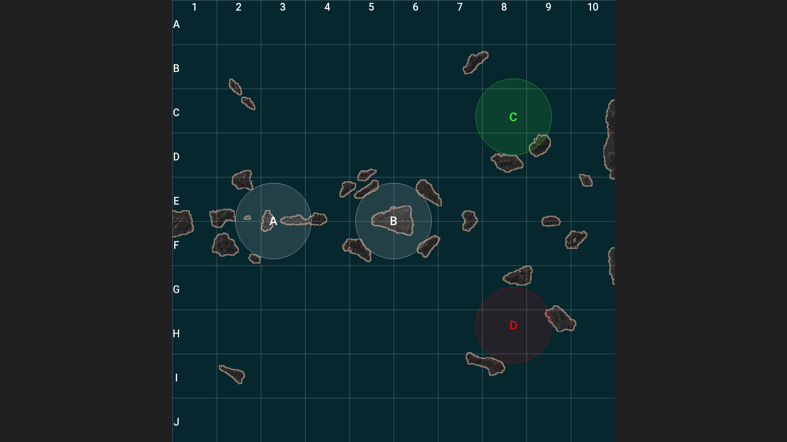
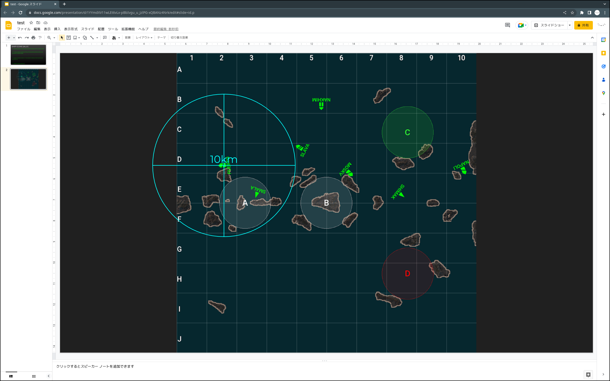

# MINIMAP_IMAGE

Generate minimap images for tactics planning. Set the images as the background of google slide or MS powerpoint and use it by placing the ship icons.





## Usage
```
$ ./minimap_image.py --json <json unpacked replay> --out <dst filename> --size <width>x<height>
```
- `--size` is optional. The default size is 1920x1080.


## Depends
- replay unpack
  - https://github.com/void-hoge/replays_unpack
  - original: https://github.com/Monstrofil/replays_unpack

## See Also
- shipicons
  - https://github.com/void-hoge/shipicons 
